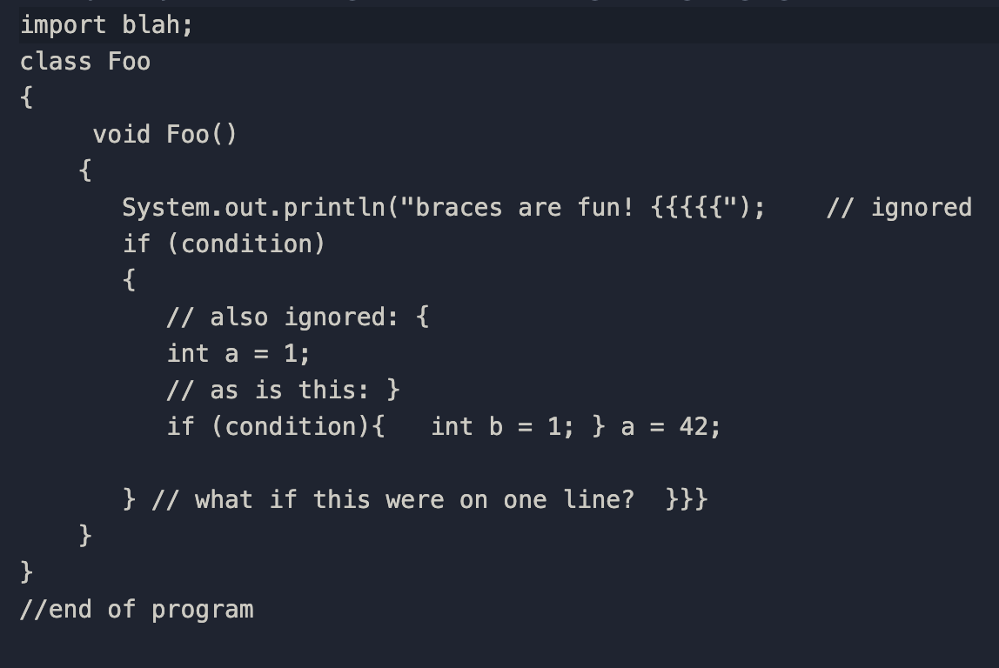
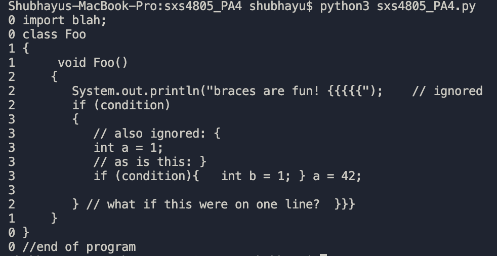

# Brace-Depth
Program that calculates brace depth using Python

# This Program:
- Lists the nesting depth of curly braces from an input file
- Ignores braces insdie quotes or comments
- Tests for unmatched braces (expected ‘}’ but found EOF); output an error message
- Allow for multiple braces on the same line, for example “}}” ending a loop and a function
- Handles block comments that cross multiple lines of the input file.

# Assumptions:
- Assume braces can be anywhere
- Assume that all quoted strings begin and end on the same line

# Sample Input File

# Sample Output

# Details
- The code is located in sxs4805_PA4.py
- The sample input file is SampleInput.txt
- More detailed directions can be found in CSE3302-Lab-Brace-Depth.pdf
